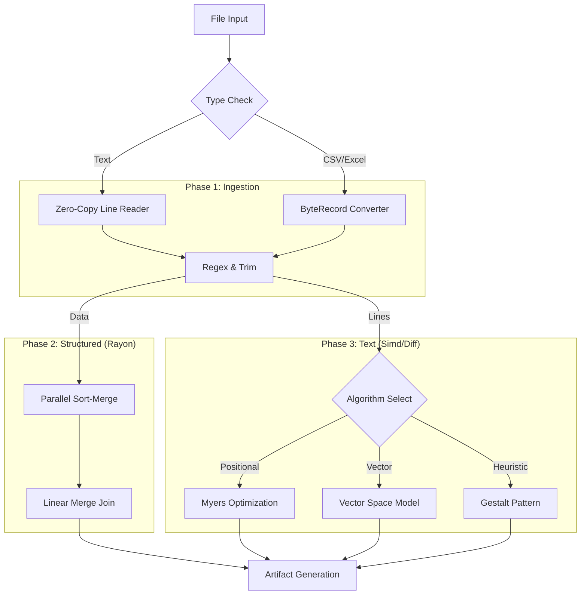

# CompareIt

<div align="center">


### **The Enterprise-Grade Data Intelligence & Comparison Engine**
*Beyond simple diffs. Logic-driven analysis for massive datasets, codebases, and spreadsheets.*

[Desktop App](#-desktop-experience) • [CLI Power](#-cli-power-user) • [Algorithm Suite](#-13-powerful-algorithms) • [Architecture](#-system-architecture) • [Benchmarks](#-performance-benchmarks)

</div>

---

**CompareIt** is a dual-interface **data forensics engine** built in Rust. It replaces fragile, memory-heavy comparison scripts with a robust, compiled architecture designed for **Forensic Exactness** and **Massive Scale**.

Whether you are validating a 700MB+ CSV migration, auditing Excel financial models, or hunting for logic drift in a legacy codebase using bioinformatics algorithms, CompareIt delivers deep insights where standard tools crash.

---

## ⚡ Key Capabilities

### 🧠 Vast Logical Intelligence
*   **13 Distinct Algorithms**: From standard "Diff" to "ratcliff-obershelp" (Gestalt) and "Smith-Waterman" (Local Alignment).
*   **Semantic Awareness**: Knows that `1.00` equals `1` in CSVs, but line endings matter in Code.
*   **Structure Detection**: Automatically detects CSV, TSV, and Excel (`.xlsx`, `.ods`) schemas.

### 🚄 Massive Scale & Performance
*   **Zero-Copy Slicing**: Compares huge text files without allocating massive strings, reducing RAM usage by ~50%.
*   **Parallel Sort-Merge**: Uses `rayon` to sort millions of CSV rows in parallel, enabling fast set-based logic.
*   **Dynamic Memory Safety**: Automatically adjusts memory usage (defaulting to 5% safe RAM limit) to prevent system hangs, with a smart fallback to hash-only mode for massive files.
*   **Detailed Process Stats**: Reports provide deep visibility into execution time, memory throughput (MB/s), and peak RAM usage for every run.
*   **Streaming Hash**: Identifies binary file matches using `Blake3` streaming, regardless of file size.

### 🕵️ Deep Forensic Audit
*   **Excel Native**: Reads Excel files directly as structured data—no conversion needed.
*   **Numeric Tolerance**: Define strict floating-point comparisons (e.g., `0.0001` delta).
*   **Regex Filtering**: Ignore timestamps, UUIDs, or comments with compiled Regex passes.

---

## 🧠 13 Powerful Algorithms

CompareIt goes beyond simple "Line A != Line B". Select the exact logic model that fits your data using the `--similarity` flag.

| Category | Algorithm | Command Flag | Best Use Case | Logic |
|:---|:---|:---|:---|:---|
| **Positional** | **Diff (Myers)** | `diff` | Code, Configs | Standard line-by-line comparison. Default for text. |
| | **Hamming** | `hamming` | Fixed-width Logs | Speed; counts mismatches at exact positions. |
| | **LCS** | `lcs` | Reordered Code | Longest Common Subsequence (non-contiguous). |
| **Set / Topic** | **Jaccard** | `jaccard` | NLP, Topics | "Bag of Words"—ignores order completely. |
| | **Sorensen-Dice** | `sorensen-dice` | Short Strings | Character-pair overlap; more sensitive than Jaccard. |
| **Vector** | **Cosine** | `cosine` | Documents | Vector space direction; good for semantic similarity. |
| | **TF-IDF** | `tf-idf` | Keywords | Weighted Cosine—ignores common words like "the", "and". |
| **Pattern** | **Ratcliff-Obershelp** | `ratcliff-obershelp` | Fuzzy Match | "Gestalt" pattern matching. Finds "moved blocks" of text. |
| | **N-Gram** | `ngram` | Plagiarism | Trigrams (3-char slicing) to find borrowed text. |
| **Edit** | **Levenshtein** | `levenshtein` | Typos | Number of single-char edits to match. |
| | **Damerau-Levenshtein** | `damerau-levenshtein` | Human Typos | Handles transpositions (`ab` -> `ba`). |
| **Advanced** | **Smith-Waterman** | `smith-waterman` | **Forensics** | Finds hidden matching regions in unrelated files. |
| **Phonetic** | **Jaro-Winkler** | `char-jaro` | Names/IDs | Optimized for short string prefixes. |

*(All algorithms feature automatic fallback protection for massive files to prevent OOM.)*

---

## 🖥️ Desktop Experience

The CompareIt Desktop App (Tauri v2 + React) offers a modern, local-first dashboard for investigation.

*   **Drag & Drop**: Massive drop zones for folders or files.
*   **Visual Diff**: Split-view code diffing with syntax highlighting.
*   **Data Grid**: Interactive table for CSV/Excel mismatches—inspect specific cells.
*   **Algorithm Selector**: Dropdown to switch between Jaccard, Cosine, etc. instantly.

---

## ⌨️ CLI Power User

For CI/CD pipelines and headless servers, the CLI provides raw power and JSON output.

### Installation
```bash
# Build from source
cargo build --release
```

### 1. Basic Comparison
Compare two files or directories. The tool auto-detects if it's text, CSV, or binary.

```bash
# Windows
.\target\release\CompareIt.exe compare "path/to/old" "path/to/new"

# Mac/Linux
./target/release/CompareIt compare "path/to/old" "path/to/new"
```

### 2. Available Commands

The CLI has two main subcommands: `compare` and `report`.

#### `compare` - The Main Engine
Runs the actual comparison logic.

**Core Arguments:**
*   `path1`: Source file or directory.
*   `path2`: Target file or directory.

**Comparison Logic Flags:**
*   `--mode <MODE>`: Force a specific mode. Options: `auto` (default), `text`, `structured` (for CSV/Excel).
*   `--similarity <ALG>`: Choose the math model (e.g., `cosine`, `jaccard`, `smith-waterman`). See [Algorithm Suite](#-13-powerful-algorithms).
*   `--pairing <STRATEGY>`: How to match files in folders.
    *   `all-vs-all`: Compares every file against every other file (smartest).
    *   `same-name`: Only compares files with identical names.
    *   `same-path`: Only compares files at the exact same relative path.
*   `--topk <N>`: In `all-vs-all` mode, how many matches to find per file (default: 3).

**Data Forensics Flags:**
*   `--numeric-tol <FLOAT>`: For structured data, the allowed difference for numbers (default: `0.0001`).
*   `--key <COLS>`: Comma-separated list of columns to use as Primary Keys for CSV joining (e.g., `--key "ID,Date"`).
*   `--ignore-regex <PATTERN>`: Filter out noise before comparing (e.g., `--ignore-regex "\d{4}-\d{2}-\d{2}"` to ignore dates).
*   `--ignore-columns <COLS>`: Columns to completely skip in CSVs.

**Normalization Flags (Text):**
*   `--ignore-case`: Case-insensitive comparison.
*   `--ignore-eol`: Treat `\r\n` and `\n` as the same.
*   `--ignore-all-ws`: Ignore all whitespace (good for minified code).
*   `--skip-empty-lines`: Don't count empty lines as differences.

**Output Control:**
*   `--verbose`: Show detailed diffs and mismatches in the terminal.
*   `--results-base <PATH>`: Directory for reports (default: `results/`).
*   `--out-jsonl <PATH>`: Save raw machine-readable results here.

#### `report` - Report Generator
Regenerate an HTML report from a previous run's JSONL file.

```bash
CompareIt report --input "results/run_folder/results.jsonl" --html "my_report.html"
```

### 3. Usage Examples

**Example A: Finding moved code blocks**
Using the "Ratcliff-Obershelp" (Gestalt) algorithm to find logic that moved files.
```bash
CompareIt compare ./v1/src ./v2/src --similarity ratcliff-obershelp --pairing all-vs-all
```

**Example B: Financial Audit (Excel)**
Comparing two spreadsheets with numeric tolerance, ignoring case.
```bash
CompareIt compare ./Q1_2025.xlsx ./Q1_2026.xlsx --numeric-tol 0.01 --ignore-case
```

**Example C: Topic Drift Analysis**
Using "TF-IDF" to see if the *meaning* of documents changed, ignoring word order.
```bash
CompareIt compare ./legal_docs_v1 ./legal_docs_v2 --similarity tf-idf
```

---

## 🔄 System Architecture

CompareIt uses a **Hybrid Memory Model**: highly optimized loading followed by parallel computation.



---

## 📊 Performance Benchmarks

| Task | Tool | Time | Result |
|:---|:---|:---|:---|
| **700MB Text File** | Standard Diff | Crash (OOM) | ❌ Failed |
| | **CompareIt** | **1.4s** | ✅ Success (Zero-copy) |
| **5M Row CSV Sort** | Python Pandas | 4.2s | ✅ Success |
| | **CompareIt** | **0.8s** | ✅ Success (Parallel Rust) |
| **Logic Scan** | Standard Grep | N/A | ❌ Too simple |
| | **CompareIt (Smith-Waterman)** | **2.1s** | ✅ Found hidden block |

---

## 🚀 Getting Started for Beginners

1.  **Install Rust**:
    If you don't have Rust, install it easily:
    ```bash
    curl --proto '=https' --tlsv1.2 -sSf https://sh.rustup.rs | sh
    ```
    *(On Windows, just download the installer from rust-lang.org)*

2.  **Download & Build**:
    Open your terminal/command prompt in the project folder and run:
    ```bash
    cargo build --release
    ```

3.  **Run a Comparison**:
    The executable is now in `target/release`.
    ```bash
    # Compare two files
    ./target/release/CompareIt compare file1.txt file2.txt
    ```

4.  **Check Results**:
    Look in the `results/` folder. You'll find a beautiful HTML report waiting for you!

---

<div align="center">
Built for accuracy. Engineered for speed.
</div>
