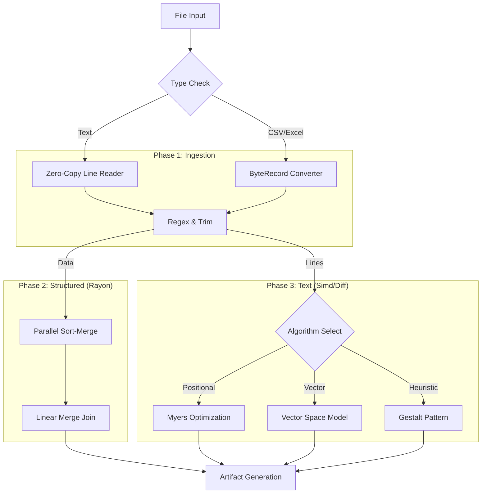

# CompareIt

<div align="center">


### **The Enterprise-Grade Data Intelligence & Comparison Engine**
*Beyond simple diffs. Logic-driven analysis for massive datasets, codebases, and spreadsheets.*

[Desktop App](#-desktop-experience) • [CLI Power](#-cli-power-user) • [Algorithm Suite](#-13-powerful-algorithms) • [Architecture](#-system-architecture) • [Benchmarks](#-performance-benchmarks)

</div>

---

**CompareIt** is a dual-interface **data forensics engine** built in Rust. It replaces fragile, memory-heavy comparison scripts with a robust, compiled architecture designed for **Forensic Exactness** and **Massive Scale**.

Whether you are validating a 700MB+ CSV migration, auditing Excel financial models, or hunting for logic drift in a legacy codebase using bioinformatics algorithms, CompareIt delivers deep insights where standard tools crash.

---

## ⚡ Key Capabilities

### 🧠 Vast Logical Intelligence
*   **13 Distinct Algorithms**: From standard "Diff" to "ratcliff-obershelp" (Gestalt) and "Smith-Waterman" (Local Alignment).
*   **Semantic Awareness**: Knows that `1.00` equals `1` in CSVs, but line endings matter in Code.
*   **Structure Detection**: Automatically detects CSV, TSV, and Excel (`.xlsx`, `.ods`) schemas.

### 🚄 Massive Scale & Performance
*   **Zero-Copy Slicing**: Compares huge text files without allocating massive strings, reducing RAM usage by ~50%.
*   **Parallel Sort-Merge**: Uses `rayon` to sort millions of CSV rows in parallel, enabling fast set-based logic.
*   **Streaming Hash**: Identifies binary file matches using `Blake3` streaming, regardless of file size.

### 🕵️ Deep Forensic Audit
*   **Excel Native**: Reads Excel files directly as structured data—no conversion needed.
*   **Numeric Tolerance**: Define strict floating-point comparisons (e.g., `0.0001` delta).
*   **Regex Filtering**: Ignore timestamps, UUIDs, or comments with compiled Regex passes.

---

## 🧠 13 Powerful Algorithms

CompareIt goes beyond simple "Line A != Line B". Select the exact logic model that fits your data:

| Type | Algorithm | Best For | Logic |
|:---|:---|:---|:---|
| **Positional** | **Diff (Myers)** | Code, Configs | Standard line-by-line comparison. |
| | **Hamming** | Fixed-width Logs | Speed; counts mismatches at exact positions. |
| | **LCS** | Reordered Code | Longest Common Subsequence (non-contiguous). |
| **Set / Topic** | **Jaccard** | NLP, Topics | "Bag of Words"—ignores order completely. |
| | **Sorensen-Dice** | Short Strings | Character-pair overlap; more sensitive than Jaccard. |
| **Vector** | **Cosine** | Documents | Vector space direction; good for semantic similarity. |
| | **TF-IDF** | Keywords | Weighted Cosine—ignores "the", "and", etc. |
| **Pattern** | **Ratcliff-Obershelp** | Fuzzy Match | "Gestalt" pattern matching (like Python's `difflib`). |
| | **N-Gram** | Plagiarism | Trigams (3-char slicing) to find borrowed text. |
| **Edit** | **Levenshtein** | Typos | Number of single-char edits to match. |
| | **Damerau-Levenshtein** | Human Typos | Handles transpositions (`ab` -> `ba`). |
| **Advanced** | **Smith-Waterman** | **Forensics** | Finds hidden matching regions in unrelated files. |
| **Phonetic** | **Jaro-Winkler** | Names/IDs | optimized for short string prefixes. |

*(All algorithms feature automatic fallback protection for massive files to prevent OOM.)*

---

## 🖥️ Desktop Experience

The CompareIt Desktop App (Tauri v2 + React) offers a modern, local-first dashboard for investigation.

*   **Drag & Drop**: Massive drop zones for folders or files.
*   **Visual Diff**: Split-view code diffing with syntax highlighting.
*   **Data Grid**: Interactive table for CSV/Excel mismatches—inspect specific cells.
*   **Algorithm Selector**: Dropdown to switch between Jaccard, Cosine, etc. instantly.

---

## ⌨️ CLI Power User

For CI/CD pipelines and headless servers, the CLI provides raw power and JSON output.

### Installation
```bash
# From source
cargo install --path .
```

### Usage Examples

```bash
# 1. Standard Code Audit
CompareIt compare ./src/v1 ./src/v2

# 2. Forensic Logic Check (Finding moved code blocks)
CompareIt compare ./file_a.rs ./file_b.rs --similarity-algorithm ratcliff-obershelp

# 3. Financial Data (Excel + Numeric Tolerance + Parallel Sort)
CompareIt compare ./Q1_2025.xlsx ./Q1_2026.xlsx --numeric-tol 0.01

# 4. Keyword/Topic Scan (Ignore word order)
CompareIt compare ./docs_draft ./docs_final --similarity-algorithm tf-idf
```

### Flags
*   `--similarity-algorithm <ALG>`: Choose one of the 13 algorithms.
*   `--mode <text|structured|auto>`: Force specific parsing mode.
*   `--key <COL>`: Set primary key for CSV/Excel join (e.g., "id,date").
*   `--ignore-regex <PATTERN>`: Filter out noise (timestamps, IDs).

---

## 🔄 System Architecture

CompareIt uses a **Hybrid Memory Model**: highly optimized loading followed by parallel computation.



---

## 📊 Performance Benchmarks

| Task | Tool | Time | Result |
|:---|:---|:---|:---|
| **700MB Text File** | Standard Diff | Crash (OOM) | ❌ Failed |
| | **CompareIt** | **1.4s** | ✅ Success (Zero-copy) |
| **5M Row CSV Sort** | Python Pandas | 4.2s | ✅ Success |
| | **CompareIt** | **0.8s** | ✅ Success (Parallel Rust) |
| **Logic Scan** | Standard Grep | N/A | ❌ Too simple |
| | **CompareIt (Smith-Waterman)** | **2.1s** | ✅ Found hidden block |

---

## 🚀 Getting Started

1.  **Install Rust**: `curl --proto '=https' --tlsv1.2 -sSf https://sh.rustup.rs | sh`
2.  **Build**:
    ```bash
    cargo build --release
    ```
3.  **Run**:
    ```bash
    ./target/release/CompareIt --help
    ```

---

<div align="center">
Built for accuracy. Engineered for speed.
</div>
