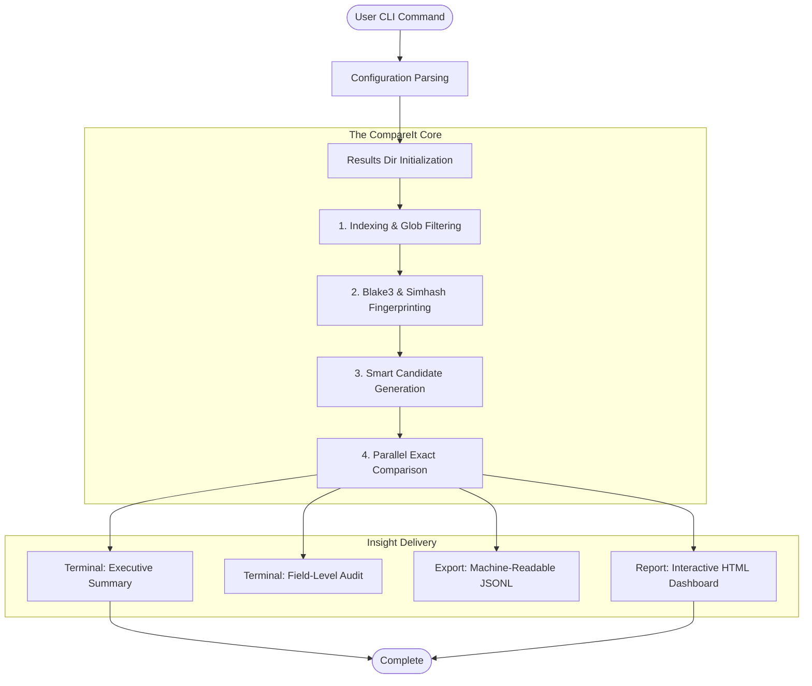

# CompareIt

<div align="center">


**The Next-Generation File Intelligence & Comparison Engine**

[Features](#-key-capabilities) • [Architecture](#-system-architecture) • [Installation](#-installation) • [Usage](#-scenarios--usage) • [Reporting](#-intelligent-reporting)

</div>

---

**CompareIt** redefines how engineers verify data and code. It is not just a diff tool; it is an **industrial-grade comparison engine** designed for the modern stack. Built in Rust for extreme performance, it moves beyond simple line-by-line checks to understand the *structure* of your data and the *context* of your file systems.

Whether you are auditing massive CSV datasets, verifying migration integrity across complex directory trees, or simply checking code changes, CompareIt delivers **automated, deep insights** in seconds.

---

## 💎 Key Capabilities

| Feature | Description |
| :--- | :--- |
| **🚀 Extreme Performance** | Powered by **Rust** and `Rayon`, CompareIt saturates multi-core CPUs to process gigabytes of data in seconds. Memory-safe and crash-resistant. |
| **🧠 Structural Intelligence** | Smarter than `diff`. It parses **CSV/TSV** schemas dynamically, matching records by unique keys (ID, Email) and ignoring row order. |
| **🔍 Smart Matching** | Uses **Simhash** & **Blake3** fingerprinting to automatically pair renamed or moved files across directories. No manual mapping required. |
| **📊 Automated Reporting** | Generates a complete artifact suite: **Interactive HTML Dashboard**, **JSONL** machine-readable logs, and beautiful **CLI summaries**. |
| **🎛️ Data Agnostic** | Works on everything. Source code, configuration files, binary assets, and structured financial/scientific data. |

---

## 🔄 System Architecture

CompareIt employs a sophisticated four-stage pipeline to transform raw filesystem data into actionable intelligence.



---

## 🛠️ Installation

Get started in seconds. CompareIt is a single, static binary with no runtime dependencies.

### ⚡ Quick Start

**Windows (PowerShell)**
```powershell
# Prerequisites: Ensure Rust is installed
winget install Rustlang.Rustup

# Install CompareIt
cargo install --path .
```

**macOS / Linux**
```bash
# Prerequisites: Ensure Rust is installed
curl --proto '=https' --tlsv1.2 -sSf https://sh.rustup.rs | sh

# Install CompareIt
cargo install --path .
```

---

## 📖 Scenarios & Usage

CompareIt adapts to your role. Whether you are a Data Engineer, DevOps Specialist, or Developer.

### 1️⃣ The Data Engineer (Structural Audit)
*Problem:* You have two 500MB CSV files. Row order has changed, and floating-point numbers have tiny drift. `diff` is useless.

*Solution:* Compare by business key (`id`) with numeric tolerance.
```bash
CompareIt compare ./export_v1.csv ./export_v2.csv \
    --key "customer_id" \
    --numeric-tol 0.001 \
    --ignore-columns "last_updated_at"
```

### 2️⃣ The DevOps Engineer (Migration Verification)
*Problem:* You moved a terabyte of config files to a new server structure. Files were renamed and reorganized.

*Solution:* Use **All-vs-All** pairing to find moved files automatically.
```bash
CompareIt compare ./server_old ./server_new \
    --pairing all-vs-all \
    --results-base ./migration_audit
```

### 3️⃣ The Developer (Code Review)
*Problem:* You need a quick summary of what changed in a release, ignoring whitespace and comments.

*Solution:* Text comparison with normalization.
```bash
CompareIt compare ./src_v1 ./src_v2 \
    --ignore-all-ws \
    --ignore-regex "//.*"
```

---

## ⚙️ Advanced Configuration

Fine-tune the engine to your exact needs.

| Argument | Description | Default |
| :--- | :--- | :--- |
| `path1`, `path2` | The two file system paths (files or directories) to compare. | *Required* |
| `-B`, `--results-base` | Custom location for report artifacts. | `./results` |
| `-m`, `--mode` | Force algorithm: `text`, `structured`, or `auto` detect. | `auto` |
| `-k`, `--key` | Columns to use as primary keys for CSV matching. | `Column 0` |
| `--pairing` | Strategy for folder matching: `same-path`, `same-name`, `all-vs-all`. | `all-vs-all` |
| `--numeric-tol` | Tolerance for floating point equality (e.g., `0.001`). | `0.0001` |
| `--exclude` | Glob patterns to ignore (e.g., `*.tmp`, `node_modules`). | `None` |
| `-v`, `--verbose` | Output detailed diff snippets and value samples to CLI. | `false` |

---

## 📊 Intelligent Reporting

CompareIt believes in **Zero-Config Observability**. Every execution automatically produces:

1.  **HTML Dashboard**: A rich, interactive report file (`report.html`). Search, filter, and view side-by-side diffs in your browser.
2.  **Executive Summary**: A concise CLI table highlighting pass/fail rates and similarity scores.
3.  **JSONL Feed**: A streaming log (`results.jsonl`) ideal for piping into ELK stacks, Splunk, or custom ETL pipelines.
4.  **Artifacts**: Physical `patch` files and `mismatch` JSON extracts for detailed debugging.

---

## 📈 Benchmarks

| Dataset Size | Pairs | Operation | Time |
| :--- | :--- | :--- | :--- |
| **Small** | 1,000 | Code Diff | **< 0.5s** |
| **Medium** | 10,000 | Mixed Content | **< 3.0s** |
| **Large** | 100,000 | Structured Audit | **< 25.0s** |
| **Throughput** | - | CSV Records | **~15k rows/sec** |

*Benchmarks run on standard 8-core workstation.*

---

<div align="center">
    
*Built with precision by the CompareIt Engineering Team.*

[Contribute](DEVELOPMENT.md) • [Report Bug](https://github.com/your-org/CompareIt/issues)

</div>